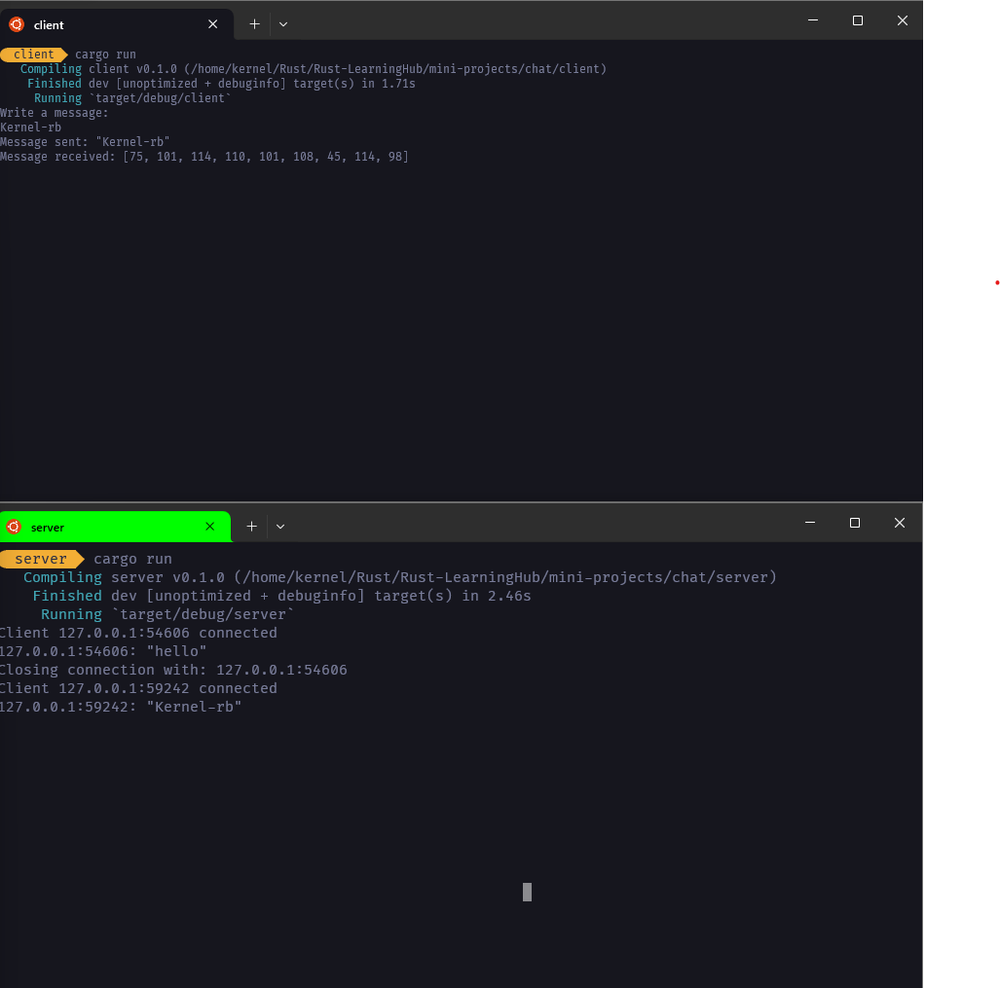

# RustChatApp

RustChatApp is a simple chat server and client written in Rust for real-time communication.
<br> 
<br>


## Installation

1. Clone the repository.
2. Build the server and client using `cargo build`.
3. Run the server with `cargo run --bin server`.
4. Run the client with `cargo run --bin client`.

## Usage

- Use the client to connect to the chat server.
- Enter messages to chat with other clients.
- Type `:quit` to exit the client.

## Features

- Basic chat functionality.
- Server-client communication.

## Examples

To connect to the server:

```sh
cargo run --bin client
```
To send a message:
```sh
Hello, this is a test message.
```

Authors:
Kernel-rb

License:
This project is licensed under the MIT License.

Contact:
For any questions or issues, please open an issue.


